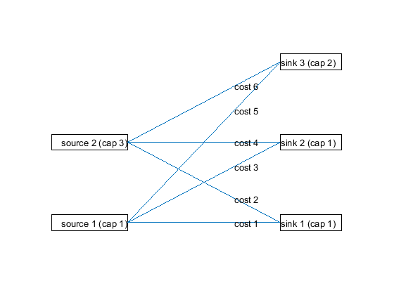
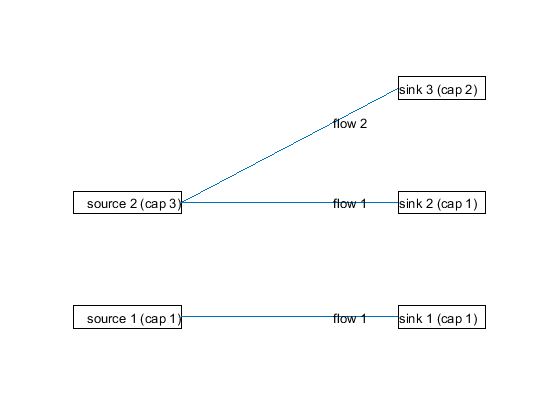

TransportAuctionMex
===================

TransportAuctionMex is an efficient implementation of the auction algorithm for [transport problems](https://en.wikipedia.org/wiki/Transportation_theory_(mathematics)) as a Mex File for MATLAB. It is based on the algorithm and C++ implementation of [J. D. Walsh](http://gatech.jdwalsh03.com/coding.html). So far only the general auction algorithm is supported (see *Walsh, J.D., Dieci, L. General auction algorithm for real valued optimal transport. Preprint, http://gatech.jdwalsh03.com, 2016*). 

Requirements
------------

  * a reasonably recent version of MATLAB
  * a C++ Compiler (tested with Visual Studio 2015)

Features
--------

  * solves transport problem for arbitrary number of sinks and sources and real-valued capacities
  * much faster than standard linear program solver
  * easy to use interface for MATLAB
  * problem is represented by two vectors and a matrix, which avoids the need for complicated graph data structures

Example usage
-------------
First, compile the mex file by calling

	>> compile

Then, you can run the auction algorithm using

	>> T = auction(a,b,-C);

Here, a and b correspond to the supply and demand of the sources and sinks, respectively. C corresponds to the costs of each connection (or alternatively, -C to the reward). The result is the matrix T that contains the amount transported from each soruce to each sink.

For further information, take a look at the included demo, which can be run using

	>> demo

License
-------

TransportAuctionMex is licensed under the GPLv3 license.

Contact
-------

Author: Gerhard Kurz

Mail: gerhard.kurz (at) kit (dot) edu

Web: [http://isas.uka.de/User:Kurz](http://isas.uka.de/User:Kurz)

